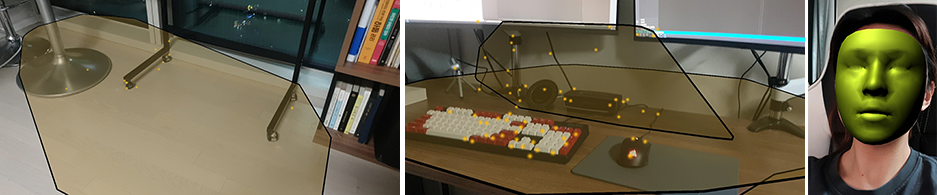
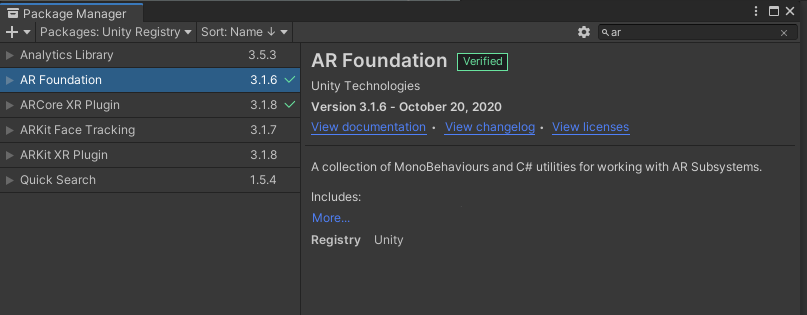
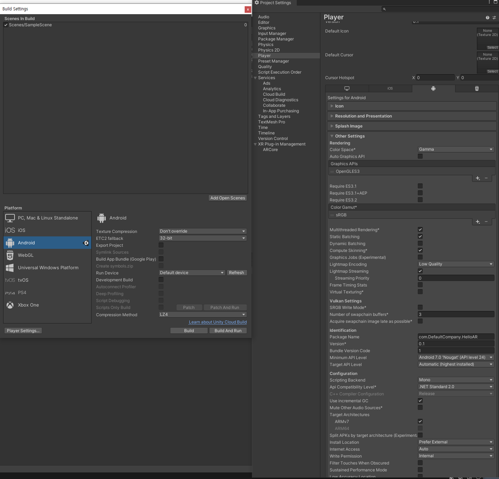
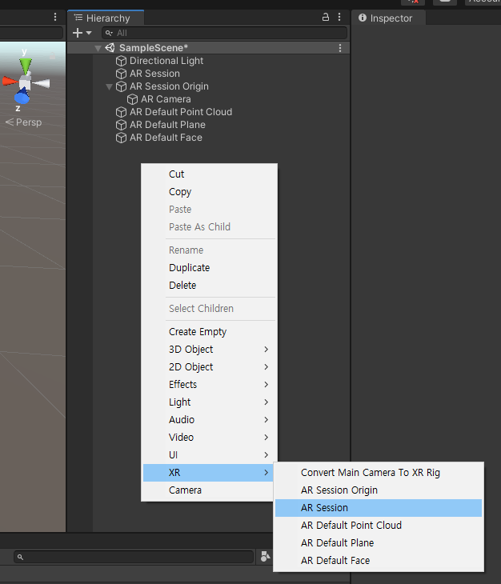
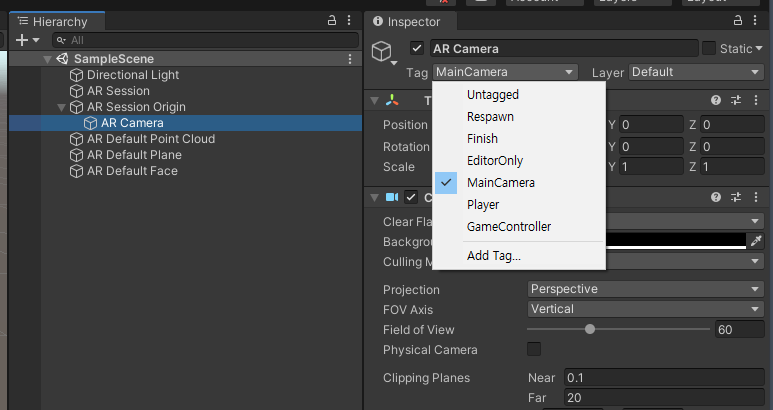
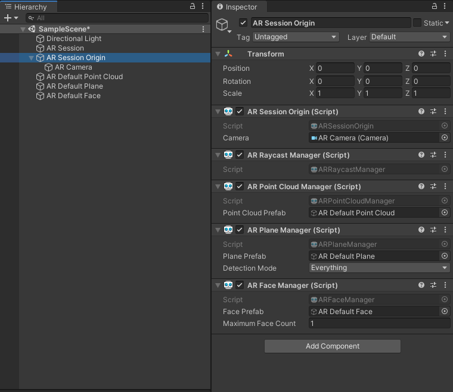

# 01. Hello Unity AR Foundation

## What's AR Foundataion?

Unity는 Cross-platform 을 지원하는 AR 플랫폼을 만들기 위해 `AR Foundation` 프레임워크를 제공한다. `ARKit`, `ARCore`, `Magic Leap`, `HoloLens`의 공통된 기능들이 추상화되어 하나의 패키지로 만들어져 있다.
`AR Foundation`으로 앱을 빌드하면 어떤 기기든 상관없이 각 플랫폼에서 지원하는 기능들을 활용 할 수 있다. 
플랫폼 마다 지원하는 feature가 조금씩 다르기 때문에 Feature Support 를 확인해보는 것이 좋다. 현재는 ARKit 기능이 가장 많다.

---

## Let's Code

가장 기본적인 AR 앱 프로젝트이다.   
AR을 지원하는 App을 빌드하고, 디바이스의 카메라를 이용해 3D로 평면 인식, 얼굴 인식이 되는 것을 확인하려 한다.  

> __OS__: Windows 10   
> __Unity__: 2020.1.16f1   
> __ARFoundation__: 3.1.6 (Verified version)   
> __Target Platform__: Android

### __1. Package Manager__

AR Foundation 을 사용하기 위해 프로젝트에 AR Fondation 패키지를 설치해야 한다.

`Window` - `Package Manager` 

- `AR Foundation` 패키지를 설치하면 자동으로 `XR Plugin Management` 도 설치된다.
- Android 빌드를 할거면 `ARCore XR Plugin`, iOS 빌드를 할거면 `ARKit XR Plugin` 을 설치해야 한다.
  
### __2. Player Settings__

Android로 AR 을 빌드하기 위한 세팅을 해준다.

`File` - `Build Settings` - `Android` - `Player Settings`

- `Other Settings` - `Graphics APIs`: `Vulkan`은 지원하지 않으니 제거
- `Other Settings` - `Minimum API Level`: API level 24 부터 지원하기 때문에 Android 7.0으로 설정

`XR Plug-in Management` 의 `Plug-in Providers` 에 있는 AR Core도 체크해준다.

### __3. Hierarchy__

AR 앱을 만들기 위한 필수 Component인 `AR Session`과 `AR Session Origin`을 추가한다.

- `AR Session` : AR Lifecycle 관리. AR 지원 기능 여부와 Session 실행 여부 확인.
- `AR Session Origin` : AR 요소들을 Unity 공간에 Transformation. 모든 AR 요소들의 scale을 조절. 

`AR Session Origin`에는 `AR Camera` 가 포함되어 있다. 사용자의 입장에서 봤을 때, 실제 카메라의 
위치라고 생각하면 된다. 카메라의 위치를 원점으로 해서 AR 요소들이 transform 된다.

`AR Camera`의 Tag를 `MainCamera`로 바꿔준다. hierarchy에 다른 카메라 컴포넌트가 있으면 삭제해준다.

### __4. Default AR Component__

위 과정까지 진행하고 빌드를 하게되면 AR카메라 화면만 뜨게 된다. 이제 이 카메라를 통해 평면이 인식되는 것을 시각화해서 확인해보자.

`AR Session Origin`에 AR 요소들을 맵핑시키기 위해 이 내부에 component들을 추가한다.

- `AR Point Cloud Manager`: feature point를 찾는 component
- `AR Plane Manager`: feature point를 기반으로 plane을 찾는 component
- `AR Face Manager`: 사람의 얼굴 mesh를 찾는 component

Default 로 제공하는 Prefab들이 이미 존재한다. hierarchy에 `AR Default Point Cloud`, `AR Default Plane`, `AR Default Face` 를 올린 후, component의 prefab 위치에 연결한다.
   
`AR Point Cloud Manager`, `AR Plane Manager` 컴포넌트를 추가하면 후면 카메라가 뜨고 `AR Face Manager`를 추가하면 전면 카메라가 뜨기 때문에 테스트를 할 때는 별개로 빌드해서 테스트 해야한다.
