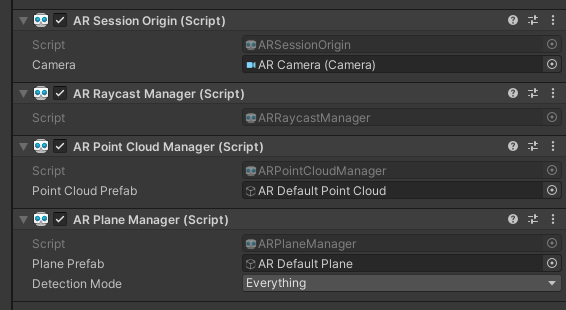

# 02. Object Placement

인식된 평면 위에 3D Object를 생성하고 원하는 위치에 배치하는 AR 앱   
이 기능만 잘 응용해도 포켓몬고와 같은 AR 앱을 만들 수 있다.

> __OS__: Windows 10   
> __Unity__: 2020.1.16f1   
> __ARFoundation__: 3.1.6   
> __Target Platform__: Android

## __1. AR Raycast Manager__



- `AR Session Origin` 에 `AR Raycast Manager` 를 추가.
  - `AR Session Origin`이 내가 카메라로 바라보는 그 위치니까 이곳을 중심으로 하는 `AR Raycast Manager`를 추가
- Unity에서 Raycast는 어떤 광선(Ray)을 쏴서 광선에 닿는(collision이 발생하는) trackable object들을 찾을 수 있다.
- Unity Physics 모듈에 이미 Raycast 인터페이스가 정의되어 있지만, AR의 trackable object 는 반드시 physics world에만 존재하는 것이 아니기 때문에 AR Foundation은 Raycast와 비슷한 별도의 인터페이스를 제공

```csharp
public bool Raycast(
    Vector2 screenPoint,                                // Ray를 쏘는 screen의 위치
    List<ARRaycastHit> hitResults,                      // Ray에 맞는 객체들이 반환됨
    TrackableType trackableTypes = TrackableType.All    // trackable object 타입 결정
)
```
  
## __2. Place On Plane Script__


특정 객체를 인식된 평면 위에 위치시키는 스크립트를 작성해보자.

### __2-1. Screen의 center에 object를 위치시키는 Script__

- 뷰포트 공간: 정규화되고 카메라를 기준으로 한다. 좌하단은 (0, 0), 우상단은 (1, 1)
- screen 공간: pixel 단위로 정의. 좌하단은 (0, 0), 우상단은 (pixelWidth, pixelHeight)
- `ViewportToScreenPoint` : `position` 을 viewport 좌표에서 screen 좌표로 변환

```csharp
using UnityEngine.XR.ARFoundation;
using UnityEngine.XR.ARSubsystems;

public ARRaycastManager arRaycaster;
public GameObject placeObject;

void Update()
{
    UpdateCenterObject();
}

private void UpdateCenterObject()
{
    Vector3 screenCenter = Camera.current.ViewportToScreenPoint(new Vector3(0.5f, 0.5f));
    List<ARRaycastHit> hits = new List<ARRaycastHit>();
    arRaycaster.Raycast(screenCenter, hits, TrackableType.Planes);

    if (hits.Count > 0)
    {
        Pose placementPose = hits[0].pose;
        placeObject.SetActive(true);
        placeObject.transform.SetPositionAndRotation(placementPose.position, placementPose.rotation);
    }
}
```

### __2-2. Touch한 위치에 object를 위치시키는 Script__

- `touchCount` : 화면에 접촉되어 있는 손가락 갯수
- `touch.GetTouch(index)` : 모바일 장치 화면에 접촉한 손가락 순서대로 Touch 구조체 반환

```csharp
public ARRaycastManager arRaycaster;
public GameObject placeObject;

GameObject spawnObject;

void Update()
{
    PlaceObjectByTouch();
}

private void PlaceObjectByTouch()
{
    Touch touch = Input.GetTouch(0);
    if (Input.touchCount > 0 && touch.phase == TouchPhase.Began)
    {
        List<ARRaycastHit> hits = new List<ARRaycastHit>();
        if (arRaycaster.Raycast(touch.position, hits, TrackableType.PlaneEstimated))
        {
            Pose hitPose = hits[0].pose;

            if (!spawnObject)
            {
                spawnObject = Instantiate(placeObject, hitPose.position, hitPose.rotation);
            }
            else
            {
                spawnObject.transform.position = hitPose.position;
                spawnObject.transform.rotation = hitPose.rotation;
            }
        }
    }
}
```